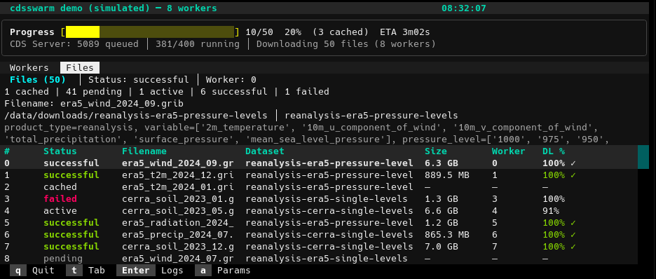

# cdsswarm

Concurrent [CDS API](https://cds.climate.copernicus.eu/) downloader with a curses TUI and script mode.

Submit multiple CDS API requests and download them in parallel with a configurable number of workers. Monitor progress through an interactive terminal UI with per-worker status panels, or run headless in script mode for CI/cron jobs.



## Installation

```bash
pip install .
```

For YAML request file support:

```bash
pip install ".[yaml]"
```

For development (tests):

```bash
pip install -e ".[dev]"
```

## Prerequisites

A valid CDS API configuration file at `~/.cdsapirc`:

```
url: https://cds.climate.copernicus.eu/api
key: <your-uid>:<your-api-key>
```

See the [CDS API documentation](https://cds.climate.copernicus.eu/how-to-api) for setup instructions.

## Quick Start

### Command Line

Create a request file `requests.json`:

```json
[
  {
    "dataset": "reanalysis-era5-single-levels",
    "request": {
      "product_type": ["reanalysis"],
      "variable": ["2m_temperature"],
      "year": ["2024"],
      "month": ["01"],
      "day": ["01", "02", "03"],
      "time": ["12:00"],
      "data_format": "grib"
    },
    "target": "temperature_jan.grib"
  },
  {
    "dataset": "reanalysis-era5-single-levels",
    "request": {
      "product_type": ["reanalysis"],
      "variable": ["total_precipitation"],
      "year": ["2024"],
      "month": ["01"],
      "day": ["01", "02", "03"],
      "time": ["12:00"],
      "data_format": "grib"
    },
    "target": "precipitation_jan.grib"
  }
]
```

Run with 4 workers:

```bash
cdsswarm requests.json --workers 4
```

### Python API

```python
import cdsswarm

tasks = [
    cdsswarm.Task(
        dataset="reanalysis-era5-single-levels",
        request={
            "product_type": ["reanalysis"],
            "variable": ["2m_temperature"],
            "year": ["2024"],
            "month": ["01"],
            "day": ["01", "02", "03"],
            "time": ["12:00"],
            "data_format": "grib",
        },
        target="temperature_jan.grib",
    ),
    cdsswarm.Task(
        dataset="reanalysis-era5-single-levels",
        request={
            "product_type": ["reanalysis"],
            "variable": ["total_precipitation"],
            "year": ["2024"],
            "month": ["01"],
            "day": ["01", "02", "03"],
            "time": ["12:00"],
            "data_format": "grib",
        },
        target="precipitation_jan.grib",
    ),
]

results = cdsswarm.download(tasks, num_workers=4)

for r in results:
    if r.success:
        print(f"Downloaded {r.task.target}")
    else:
        print(f"Failed {r.task.target}: {r.error}")
```

## CLI Reference

```
usage: cdsswarm [-h] [-w WORKERS] [-m {interactive,script,auto}] [--no-skip] requests_file
```

| Argument | Description |
|---|---|
| `requests_file` | Path to a JSON or YAML file with download requests |
| `-w`, `--workers` | Number of parallel download workers (default: 4) |
| `-m`, `--mode` | Display mode: `interactive` (TUI), `script` (plain text), or `auto` (default) |
| `--no-skip` | Re-download files that already exist on disk |

In `auto` mode, the TUI is used when stdout is a TTY and the terminal is large enough; otherwise it falls back to script mode.

## Request File Format

### List format

Each entry specifies its own dataset:

```json
[
  {
    "dataset": "reanalysis-era5-single-levels",
    "request": { ... },
    "target": "output1.grib"
  },
  {
    "dataset": "reanalysis-era5-pressure-levels",
    "request": { ... },
    "target": "output2.grib"
  }
]
```

### Compact format

Share a dataset across all requests:

```json
{
  "dataset": "reanalysis-era5-single-levels",
  "requests": [
    { "request": { ... }, "target": "output1.grib" },
    { "request": { ... }, "target": "output2.grib" }
  ]
}
```

### YAML

Both formats also work in YAML (requires `pip install cdsswarm[yaml]`):

```yaml
dataset: reanalysis-era5-single-levels
requests:
  - request:
      product_type: [reanalysis]
      variable: [2m_temperature]
      year: ["2024"]
      month: ["01"]
      day: ["01"]
      time: ["12:00"]
      data_format: grib
    target: temperature.grib
```

The `request` dict accepts the same parameters as `cdsapi.Client.retrieve()`.

## Python API Reference

### `cdsswarm.Task(dataset, request, target)`

A single CDS API download request.

| Field | Type | Description |
|---|---|---|
| `dataset` | `str` | CDS dataset name (e.g. `"reanalysis-era5-single-levels"`) |
| `request` | `dict` | Request parameters, same format as `cdsapi.Client.retrieve()` |
| `target` | `str` | Local file path to save the downloaded data |

### `cdsswarm.download(tasks, num_workers=4, skip_existing=True, on_message=None)`

Download multiple CDS API requests concurrently.

| Parameter | Type | Default | Description |
|---|---|---|---|
| `tasks` | `list[Task]` | required | List of download tasks |
| `num_workers` | `int` | `4` | Number of parallel workers |
| `skip_existing` | `bool` | `True` | Skip files that already exist |
| `on_message` | `callable` | `None` | Callback `fn(message: str)` for status updates |

Returns a `list[Result]`. Returns an empty list if interrupted by `KeyboardInterrupt`.

### `cdsswarm.Result`

| Field | Type | Description |
|---|---|---|
| `task` | `Task` | The original task |
| `success` | `bool` | Whether the download succeeded |
| `error` | `str` | Error message (empty on success) |

## TUI

The interactive TUI (terminal user interface) is only available via the CLI. It shows:

- One panel per worker with CDS API status badges (accepted/running/successful/failed), request IDs, and log messages
- A global progress bar with percentage, file count, and ETA
- Download progress per worker (MB downloaded)

The TUI requires a terminal of at least 40 columns and 10 rows. Press any key to exit after all downloads complete.

Press `Ctrl+C` to cancel — in-flight CDS API requests will be cancelled on the server.

## Running Tests

```bash
pip install -e ".[dev]"
pytest -v
```

## License

MIT
